# Peak AI NPC

A self-hosted AI NPC system for FiveM. Give your NPCs real conversations, voice, memory, and tools — powered by your own AI API keys.

[](LICENSE)
[](https://discord.gg/gAqXUaVEMn)
[](https://github.com/Peak-Studios/peak-ai-npc)

---

## What it does

- **Talk to any NPC** — Players can walk up to a configured NPC or any eligible ambient ped and have a real conversation.
- **Typed and voice input** — Keyboard text or hold-to-talk microphone (PTT). Text fallback is always available when voice isn't.
- **Realistic voice output** — NPC responses are spoken aloud via ElevenLabs TTS with per-character voice profiles, spatial audio, and lip sync.
- **Memory** — NPCs remember players across sessions using file-backed or PostgreSQL memory stores.
- **NPC tools** — NPCs can take game actions: give items, start missions, open shops, run framework commands.
- **Vision** — Optional: NPCs can see what's happening in the game via screenshot context.
- **Residents** — Ambient NPCs with simulated personalities that evolve over time.
- **Framework support** — QBCore, ESX, Ox, custom. Gracefully degrades when optional dependencies aren't present.

---

## Architecture



```
FiveM server (peak-ai-npc/)
       │  HTTP (shared secret)
       ▼
Gateway (gateway/)  ──── LLM provider (Groq, OpenAI, Ollama, Anthropic, Gemini…)
       │                ── TTS provider (ElevenLabs, Cartesia, OpenAI…)
       │                ── STT provider (Whisper-compatible)
       ▼
  PostgreSQL (optional memory persistence)
```

The FiveM resource never holds API keys. All provider credentials stay in the gateway's `.env`.

---

## Requirements

You need:

- A FiveM server (with a valid FiveM license)
- Node.js 20+ for the gateway
- **At least one AI text provider** — any OpenAI-compatible API works (Groq, OpenRouter, Together, Mistral, local Ollama, etc.)
- **Optional**: ElevenLabs or Cartesia for voiced NPC speech
- **Optional**: A Whisper-compatible STT endpoint for player voice input
- **Optional**: PostgreSQL for persistent NPC memory

See [Providers Guide](docs/PROVIDERS.md) for the full list of supported providers and free/cheap options.

---

## Quick Start

### 1. Set up the gateway

```powershell
cd gateway
Copy-Item ../．env.example .env
# Edit .env — add your provider keys and set AI_NPC_GATEWAY_SECRET
npm ci
npm run build
npm start
```

The gateway listens on `http://127.0.0.1:8787` by default.

### 2. Install the FiveM resource

Copy `peak-ai-npc/` into your server's `resources/` directory.

Add to `server.cfg`:

```cfg
set peak_ai_npc_gateway_url "http://127.0.0.1:8787"
set peak_ai_npc_gateway_secret "your-AI_NPC_GATEWAY_SECRET-value"
ensure peak-ai-npc
```

> For a production gateway on a separate host, set `peak_ai_npc_gateway_url` to your HTTPS gateway URL and set `AI_NPC_LOCAL_DEVELOPMENT=false` in the gateway `.env`.

### 3. Configure your first NPC

Edit [`peak-ai-npc/npcs/examples.lua`](peak-ai-npc/npcs/examples.lua) — it has ready-to-use example NPCs with full comments. See [NPC Authoring Guide](docs/NPC_AUTHORING_GUIDE.md) for all options.

### 4. (Optional) Docker

```powershell
Copy-Item .env.example gateway/.env
# Edit gateway/.env
docker compose up --build
```

---

## In-Game Commands

| Command / Key | Description |
| :--- | :--- |
| `/ainpc` | Talk to the aimed configured NPC or eligible ambient ped |
| `G` (hold) | Hold to speak with voice; remap in FiveM key bindings |
| `/ainpcvision [prompt]` | Request screenshot analysis (requires vision provider + `screenshot-basic`) |
| `/ainpc_subtitles [mode]` | Set subtitle mode: `always`, `never`, `audio_failed`, `accessibility` |
| `/ainpc_accessibility [on\|off]` | Toggle high-contrast subtitle overlay |
| `ainpc_status` | Server console diagnostic status report (ACE admin) |

---

## Configuration

### Gateway (`gateway/.env`)

Copy `.env.example` to `gateway/.env` and fill in your values:

```env
# Shared secret — must match peak_ai_npc_gateway_secret in server.cfg
AI_NPC_GATEWAY_SECRET=replace-with-a-long-random-secret

# Text provider (any OpenAI-compatible API, or ollama/anthropic/gemini)
AI_NPC_PROVIDER=openai-compatible
AI_NPC_PROVIDER_KEY=your-api-key
AI_NPC_PROVIDER_ENDPOINT=https://api.groq.com/openai/v1
AI_NPC_PROVIDER_MODEL=llama-3.1-8b-instant

# TTS provider (optional — text subtitles always work without this)
AI_NPC_TTS_PROVIDER=elevenlabs
AI_NPC_TTS_KEY=your-elevenlabs-api-key
AI_NPC_TTS_MODEL=eleven_flash_v2_5

# STT provider (optional — keyboard text always works without this)
AI_NPC_STT_PROVIDER=openai-compatible
AI_NPC_STT_KEY=your-api-key
AI_NPC_STT_ENDPOINT=https://api.groq.com/openai/v1
AI_NPC_STT_MODEL=whisper-large-v3-turbo

# URL players connect to for audio (use HTTPS in production)
AI_NPC_PUBLIC_BASE_URL=http://127.0.0.1:8787
AI_NPC_LOCAL_DEVELOPMENT=true
```

Full reference: [`.env.example`](.env.example) | [Configuration Guide](docs/CONFIGURATION_GUIDE.md) | [Providers Guide](docs/PROVIDERS.md)

### FiveM resource (`peak-ai-npc/shared/config.lua`)

Configure interaction distance, framework, target system, subtitles, and voice options. See [Configuration Guide](docs/CONFIGURATION_GUIDE.md).

### Open-for-edit files

These files are designed to be customized and are safe to edit:

| File | Purpose |
| :--- | :--- |
| [`shared/config.lua`](peak-ai-npc/shared/config.lua) | Interaction distance, framework, voice, subtitles |
| [`shared/voice_casting.lua`](peak-ai-npc/shared/voice_casting.lua) | Voice profile assignments per NPC |
| [`npcs/examples.lua`](peak-ai-npc/npcs/examples.lua) | Your NPC definitions |
| [`client/targets.lua`](peak-ai-npc/client/targets.lua) | ox_target / qb-target / native interaction logic |
| [`locales/*.lua`](peak-ai-npc/locales/en.lua) | UI strings |
| [`shared/constants.lua`](peak-ai-npc/shared/constants.lua) | Shared event names (for integrations) |

---

## Documentation

- [Getting Started](docs/GETTING_STARTED.md)
- [Configuration Guide](docs/CONFIGURATION_GUIDE.md)
- [NPC Authoring Guide](docs/NPC_AUTHORING_GUIDE.md)
- [Providers Overview](docs/PROVIDERS.md)
- [Deployment](docs/DEPLOYMENT.md)
- [Targets & Locales](docs/TARGETS_AND_LOCALES.md)
- [Integration & Server Exports](docs/INTEGRATION.md)
- [Compatibility Matrix](docs/COMPATIBILITY_MATRIX.md)
- [Ambient NPCs & Local TTS](docs/AMBIENT_NPCS_AND_LOCAL_TTS.md)
- [Privacy & Operations](docs/PRIVACY_AND_OPERATIONS.md)

---

## Supported Providers

| Category | Providers |
| :--- | :--- |
| **Text (LLM)** | OpenAI, Groq, Ollama, Anthropic, Gemini, OpenRouter, Together, Mistral, LiteLLM, and any OpenAI-compatible endpoint |
| **TTS (Voice)** | ElevenLabs, Cartesia, OpenAI TTS, and any OpenAI-compatible TTS |
| **STT (Speech)** | Whisper (via Groq, OpenAI, or local) |
| **Vision** | OpenAI Vision, Gemini Vision, Ollama Vision |

---

## Contributing

Pull requests are welcome! See [CONTRIBUTING.md](CONTRIBUTING.md) to get started.

---

## License

[MIT](LICENSE) — free to use, modify, and distribute. Attribution appreciated but not required.
